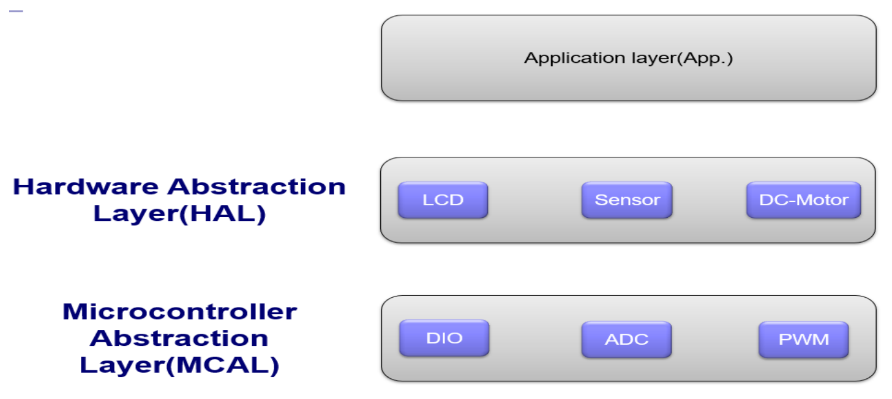

# Fan Speed Controller with Temperature
 - Developing a system that controls the speed of a fan depending on the temperature. - Drivers: GPIO, ADC, PWM, LM35 Sensor, LCD and DC-Motor - Microcontroller: ATmega16.

